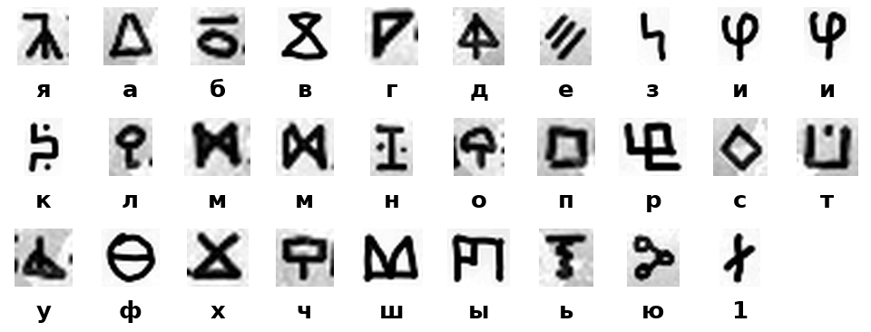

# The rune script, read in full

The collage carries a geometric script in 3 places: a block of 3 lines at the top left
(over the masked crowd), a column along the right edge, and a line under the dial. Word
separators are colons. Earlier passes established only that the script is a monoalphabetic
substitution of a natural language and that its index of coincidence fits Russian. On
2026-09-24 I read all 3 inscriptions with one key. Every one of the 19 words is a Russian
dictionary word, so the key is certified by the text itself.

## Method

1. Each region was cropped from `clues/welcome-to-the-brave-new-world.png`, the background
   was estimated with a 31-pixel median filter and subtracted, and glyphs were cut into
   cells by connected components merged on horizontal overlap (`tools/fig_rune_key.py`
   reproduces the crops from the boxes in `data/rune-key.json`).
2. Orientation of the column. Read with the tops of the glyphs pointing right (rotate the
   crop counter-clockwise), the column shows down-pointing triangles, cups open at the
   bottom and circles hanging under their stems, while the upright block at the top left
   shows only up-pointing triangles, cups open at the top and circles on top of their
   stems. Rotating the column clockwise instead makes both alphabets identical. So the
   column is written with the tops of the glyphs pointing left and reads from the bottom of
   the image to the top, the way a book spine is lettered in Europe.
3. Cryptanalysis by word pattern. The third word of the column and the second word of the
   third top-left line share the same 5 opening glyphs; 4 words end in the same glyph; 3
   words carry the same 2-glyph run in the middle. Under the hypothesis that the most
   frequent glyph (a circle on a stem with a crossbar, 10 of 103) is "о", the 5-letter word
   with the pattern 1-2-3-4-3 resolves to "много", the 4-letter word ending in the shared
   final glyph to "день", the 5-letter word with the same ending to "здесь", the 7-letter
   word to "надеюсь", and the rest follows by substitution.
4. Check. Each decoded word was looked up in a Russian word-frequency list built from
   OpenSubtitles (hermitdave/FrequencyWords, `content/2018/ru/ru_full.txt`): 18 of 19 words
   are present as written; the 19th, "черныи", is "черный" with the letter "й" written as
   "и", which the key has no separate glyph for.

## The key



27 distinct signs: 26 Cyrillic letters and one sign I read as the digit 1. Two letters have
2 written forms each ("и" as a closed oval on a stem and as an open cup on a stem; "м" as an
M with crossing inner strokes and as an X between two vertical bars). The letters ж, й, ц, щ,
э, ъ and ё do not occur. The exemplar boxes, shapes and letters are listed in
`data/rune-key.json`.

| Letter | Shape of the glyph |
|---|---|
| а | triangle, apex up |
| б | circle with a bar above it |
| в | hourglass: an X between a top bar and a bottom bar |
| г | right triangle |
| д | triangle on a stem, with a crossbar on the stem |
| е | three parallel slashes |
| з | hook, like a 4 without its crossbar |
| и | circle with a vertical line through it; also drawn as an open cup on a stem |
| к | 5-like hook with a dot |
| л | circle on a stem, no crossbar |
| м | M with crossing inner strokes; also drawn as an X between two vertical bars |
| н | I with serifs |
| о | circle on a stem, with a crossbar |
| п | square |
| р | square cup with an inner bar and a foot |
| с | diamond |
| т | cup, open at the top |
| у | triangle with a mast on its left side |
| ф | circle with a horizontal bar through it |
| х | X |
| ч | rectangle on a stem |
| ш | M whose middle vertex reaches the baseline |
| ы | square M, open at the bottom |
| ь | T with a wavy bar hanging from it |
| ю | three small circles joined by lines |
| я | lambda-like glyph with a foot on its right leg |
| 1 | vertical stroke with a short diagonal bar, likely the digit 1 (see below) |

## The three inscriptions

Top-left block, 3 lines, read left to right, upright:

```
я : надеюсь : что : сюда
будут : присылать
много : биткоинов
```

"Я надеюсь, что сюда будут присылать много биткоинов": I hope that a lot of bitcoins will
be sent here. The block sits above the escrow address, which is printed vertically along
the left edge over the lines "PAY FOR THE FUTURE. THIS IS THE FIRST PREDICTION."

Right-edge column, read from the bottom of the image to the top, glyph tops pointing left:

```
здесь : зашифрованы : биткоины : на : черныи : день : номер : 1
```

"Здесь зашифрованы биткоины на чёрный день. Номер 1": bitcoins for a rainy day (literally
a black day) are encrypted here. Number 1. The last sign is the only one that is not a
letter of the key; a vertical stroke with a short diagonal bar, which I read as the digit 1.
It could also be an unrelated mark, since it is the only occurrence.

Line under the dial, left of the coin, read left to right, upright:

```
сумма : двух : чисел
```

"Сумма двух чисел": the sum of two numbers. The line is printed directly under the dial's
hands.

## What the text does and does not carry

1. No seed word is spelled out. The words "black" and "day" ("чёрный день"), "number" and
   "one" ("номер 1"), "first" and "predict" (left edge) are all in the BIP39 list, but they
   arrive through translation, not as list words; I record the coincidence and do not build
   a candidate on it.
2. The dial line is a reading rule. Measured on the published image (dial centre at about
   (470, 938), the numeral centroids read off the 3x enlargement), the hand labeled TOWER
   points between the numerals 1 and 2 (about 1.5), the red hand labeled MOON between 12 and
   1 (about 12.6), and the short unlabeled hand between 10 and 11 (about 10.4). "The sum of
   two numbers" applied to the two numerals each hand points between gives TOWER 1 + 2 = 3,
   MOON 12 + 1 = 13, unlabeled 10 + 11 = 21. The first two are exactly the two anchors
   ("tower at position 3, moon at position 13") that circulated on Reddit from 2020 and that
   `analysis/tested.md` retracts as untraceable to the author. They are traceable now: they
   follow from the author's own instruction on the image. The fractional hand positions,
   which the earlier measurement took as evidence against those anchors, are the mechanism.
3. A position 13 does not exist in a 12-word phrase. Either the phrase is longer than 12
   words (BIP39 allows 15, 18, 21 and 24; old-Electrum v1 does not), or "13" is the BIP39
   passphrase slot. Every sweep in `analysis/tested.md`, mine and the community's, assumed
   12 words. This is the lead I would rank first (`analysis/leads.md`, lead 5).
4. The other inscriptions are commentary: a joke about donations to the escrow, and a
   statement that the coins are "encrypted here". "Number 1" may be the author's numbering
   of the puzzle.

## What remains unread

- The 7-sign fragment right of the mirrored coin, at about (830 to 990, 825 to 880). The
  first 4 signs (two stacked triangles, a mirrored E, a mirrored N, a down-pointing
  triangle) are drawn in a thinner, Latin-like style that does not belong to the rune key;
  a period follows, then 3 signs of which the last is the rune for "ю" and the first
  resembles the rune for "к". The earlier ledger records this fragment as a Bill Cipher
  reading "DAY"; I could not verify that reading offline, and it accounts for at most 3 of
  the 7 signs.
- The 4 dark and 5 light words of the whitepaper sentence along the bottom edge ("in wich
  they were received. The payee needs proof that at the time of each transaction, the
  majority of nodes agreed it was the first received") may be shading from the overlapping
  drawings rather than a mark; I did not resolve it.
- The pedestal engraving (the 13th Amendment, Section 1) underlines exactly two things: the
  "1" of "Section 1" and the word "subject".
