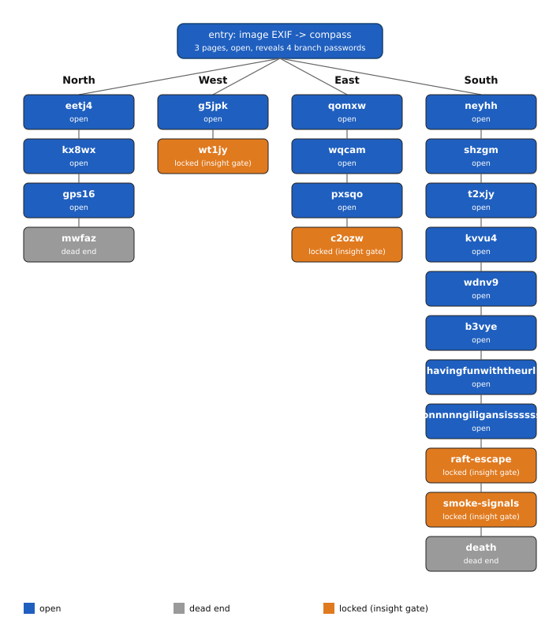

# Smith, Lyle & Moore Hunt #2: Glimmer (0.031777 BTC, [OPEN])

The band Smith, Lyle & Moore funded a second treasure hunt on their Wix site on 2022-07-29,
after a first hunt a reader solved and swept. The site is a roughly 70-page maze of
password-gated pages; an image's EXIF data opens a compass page revealing four branches.
Three branches end in a page whose password is an author-written riddle answer, not a
decoded cipher; the fourth is a decorative dead end. All 12 BIP39 words and a passphrase
needed to sweep the wallet sit behind those three pages. I hold every password up to each
lock and tested about 5,000 candidate answers with no hit. The published account xpub
confirms the wallet and derivation path; what is missing is the riddle answers, not the
cryptography.

## At a glance

| | |
|---|---|
| Author | Smith, Lyle & Moore (band); site credited to Thom Miles Royle, [smithlylemoore.com](https://www.smithlylemoore.com/treasure-hunt) |
| Published | 2022-07-29, [smithlylemoore.com/treasure-hunt](https://www.smithlylemoore.com/treasure-hunt) |
| Prize | 0.031777 BTC (about $2,002 at BTC = $63,000, 2026-08-16) |
| Chain | bitcoin |
| Escrow | `bc1q0akdjvrc2csau2n3gyxa3xcq0fss852x997m9y` ([mempool.space](https://mempool.space/address/bc1q0akdjvrc2csau2n3gyxa3xcq0fss852x997m9y)) |
| Last on-chain check | 2026-10-02: funded and unspent (3,177,700 sats received, 0 spent, 1 transaction) |
| Status | OPEN |
| Puzzle type | bip39-seed, password-pages, web-tree |
| Target format | BIP39 12 words, English wordlist, plus a passphrase, BIP84 `m/84'/0'/0'/0/0`, P2WPKH |
| Certified oracle | yes: `tools/oracle.py --selftest` (certified against the published account xpub, whose m/0/0 P2WPKH address equals the escrow; see "Certified against" for the scope this does and does not cover) |
| What remains | the riddle answers for 4 gates: West, East, and the two island exits (`/raft-escape`, `/smoke-signals`) past the now-solved South lock; an insight problem, not a compute problem |
| Series | none (a first hunt on the same site, "Born to Be Wild", was solved and swept by another reader years ago; I use its known solution only as a template, see Mechanism) |

## The puzzle as published

The band's Wix site carries a `/treasure-hunt` page whose opening line reads "I Be The Ruler
of the Seven Seas". An image on that page carries EXIF GPS coordinates; entering the latitude
and then the longitude as consecutive page passwords opens a compass page that displays four
branch passwords in clear text: `north64`, `south64`, `east64`, and `west64`. Past that point
the site frames the hunt as a branching structure where some paths lead nowhere and others
lead to the treasure.

Three branches (West, East, South) each end on one password-gated page whose full riddle
text I quote in [clues/author-posts.md](clues/author-posts.md): a pirate-themed riddle naming
Blackbeard, Napster's Shawn Fanning, Metallica's Lars Ulrich, Silk Road's Ross Ulbricht, and
Pirate Bay's Gottfrid Svartholm and Fredrik Neij (West); a deep-sea narcosis riddle asking
"is this the end?" (East); and a page titled "Name 6" asking for the sixth Gilligan's Island
castaway, reached after naming the other five in sequence (South). The fourth branch, North,
ends on a static "coming soon" page.

The band's earlier hunt, "Born to Be Wild" (2021, an Apollo/moon theme on the same site), was
solved and swept by a reader; no write-up of that solution or of this second hunt exists that
I have found, beyond a 2024-08-23 stacker.news post flagging this hunt as still unsolved.

## What is understood

### Mechanism

The published wallet is a standard BIP39 seed with a passphrase, derived along BIP84 to a
P2WPKH address. The 12 words and the passphrase are scattered as fragments behind the three
locked pages; I have not recovered any of them. Every page reachable without opening one of
the three locks has been read directly and carries none of the 12 words (full channel map in
[analysis/mechanism.md](analysis/mechanism.md)).


*Figure 1. The full page-chain structure reached from the entry page, by branch and state (source: data/site-structure.csv, script tools/fig_structure.py), 2026-08-16.*

### Derivation and oracle

```
python3 tools/oracle.py --selftest                      # must print SELFTEST OK
python3 tools/oracle.py "w1 w2 ... w12"                  # empty passphrase
python3 tools/oracle.py "w1 w2 ... w12" "passphrase"     # with passphrase
python3 tools/oracle.py --stdin                          # "mnemonic:passphrase" per line
```

A candidate mnemonic is validated against the BIP39 checksum, turned into a seed with the
given passphrase, and walked down the standard BIP32/44/49/84 account paths. A match is
reported if the resulting account extended public key equals the author's published xpub, or
if the resulting `.../0/0` P2WPKH address equals the escrow. `MATCH ... address=... WIF=...`
on a hit, `NO MATCH` otherwise, exit code 0 or 1. On a match, the WIF sweeps directly to my
own wallet, `bc1qax0hsnwnxl7393awtc3hsy0ftm6tg4tyk2nfja` ([mempool.space](https://mempool.space/address/bc1qax0hsnwnxl7393awtc3hsy0ftm6tg4tyk2nfja)).

### Certified against

The author published the wallet's account xpub,
`xpub6CpNc58zqQvNGPHDGGTr68wgrmtfFDBWRuSDAxoDdrCE1iRAaZtyAD5T9uCJ3ELUYKCkx8Jkind2kwoR3Uxmg1ycQ6DWyGxZBMFvQqhNqVC`,
directly on the puzzle site. `tools/oracle.py --selftest` reproduces that its `m/0/0` address
in P2WPKH form equals the escrow, and separately confirms that a known-wrong mnemonic (the
public BIP39 test vector "abandon...about") produces `NO MATCH`, so the harness both accepts
and rejects correctly. Reproduced 2026-08-16.

This certifies the BIP32-derivation and P2WPKH-encoding half of the pipeline. It does not
certify the BIP39-mnemonic-to-seed half end to end, because no 12-word mnemonic that actually
reproduces this xpub is known to me: 0 of 12 words are held. A `NO MATCH` from this oracle is
trustworthy math; it is not evidence about whether a given set of words is the right set.

### Established facts

1. The escrow is funded and unspent: 3,177,700 sats received in 1 transaction on 2022-07-29,
   0 spent, confirmed via [mempool.space](https://mempool.space/address/bc1q0akdjvrc2csau2n3gyxa3xcq0fss852x997m9y) on 2026-08-16.
2. The published account xpub's `m/0/0` address, encoded as P2WPKH, equals the escrow
   (`tools/oracle.py --selftest`).
3. Page passwords on this site are case sensitive: the known-good passwords `Gilligan` and
   `Ginger` succeed only in Title Case and fail in both lowercase and all caps.
4. The North branch carries 0 of the 12 words: every page on it was read directly and ends
   on a static page with no further content.
5. The West and East locks require lowercase, single-token passwords with no digits, matching
   every other password already known on those branches. The South lock requires a Title
   Case single token, matching the naming pattern of the five prior South pages.
6. No numeric suffix appears in any password I have opened that is not directly visible in an
   image on that same page.
7. The site's password gate is enforced server side: the page body is not served to a normal
   browser before the correct password is entered, confirmed by direct inspection.

## What has been tested

Full ledger in [analysis/tested.md](analysis/tested.md). Summary:

| Hypothesis | Space | Method | Result | Witness | Date |
|---|---|---|---|---|---|
| West lock: a single word connects the riddle's named pirates | about 2,100 candidates, overwhelmingly lowercase | direct page-password submission | 0 match | uncertified: no known-good candidate for this locked page | 2026-07-25 |
| East lock: a diving/pop-culture term answers "is this the end?" | about 2,030 candidates | direct page-password submission | 0 match | uncertified: no known-good candidate for this locked page | 2026-07-25 |
| South lock: the sixth Gilligan's Island castaway, full show canon | about 775 candidates, Title Case | direct page-password submission | 0 match, canon exhausted | uncertified: no known-good candidate for this locked page | 2026-07-25 |
| Puzzle-wide lowercase password rule | 2 known passwords retested in 3 case forms each | direct page-password submission on open gates | refuted: only Title Case succeeds | yes: both known-good passwords reproduced | 2026-07-25 |
| Cover-art trailer-byte channel (word 1) | 1,585 images | byte scan after EOF, same method that finds the real payload on the solved Hunt #1 cover | 0 match on Hunt #2 material | yes: positive control on the Hunt #1 cover | 2026-07-14 |
| Audio steganography on the public master | 1 file, 4 techniques | Morse/reverse/LSB/spectrogram analysis | 0 match, no alternate mix found | uncertified | 2026-07-10 |
| **South lock `b3vye` ("Name 6")** | the Professor's name under a different title | direct page-password submission | **SOLVED: `Dr. Roy`** (period and space); the branch now runs to its island fork | yes: the gate opened | 2026-10-02 |

The South lock is solved; see [analysis/tested.md](analysis/tested.md) for the full chain. The
live frontier is now two island-exit gates, `/raft-escape` and `/smoke-signals`, plus the
still-unopened West and East locks.

## Open leads, ranked

1. **Retry the West lock in Title Case** (minutes). The lowercase-only assumption behind
   about 1,560 of the West candidates is refuted; the same candidate list has not been
   meaningfully retried in Title Case. Confirmed if any candidate opens the page.
2. **Retry the East lock on the exact "does not end here" film line** (minutes). The East
   riddle chain is a confirmed Gandalf reference (`youshallpass47` on an earlier page); the
   exact wording of Pippin's line to Gandalf after his fall has not been tried, only near
   variants (`gandalfthewhite`, `mithrandir`, `flyyoufools`, `theturnofthetide`, `endno`).
3. **Reverse image search the `LifeFlashBeforeEyes.mp4` clip stills on the East branch**
   (hours). If any still frame is identifiable, its source title is a strong East candidate.
4. **South lock: solved** (`Dr. Roy`). Each downstream page turned out to be separately gated,
   not opened in one step; `Mary Ann` leads to the island, which forks into three gates.
5. **The two island exits, `/raft-escape` and `/smoke-signals`** (the live frontier). Both are
   unopened insight gates; a public solver reports ~250,000 failed guesses here, so the lead is
   the Glimmer song/video (the band says the story is "woven into" it), not a longer wordlist.

Full notes: [analysis/leads.md](analysis/leads.md).

## Files in this folder

| Path | What it is |
|---|---|
| `clues/author-posts.md` | verbatim riddle text and entry-page quotes from the puzzle site, with links |
| `data/site-structure.csv` | the page chain per branch (page id, state), from direct site navigation |
| `analysis/mechanism.md` | the full 7-channel carrier map and branch-format rules |
| `analysis/tested.md` | the complete negatives ledger |
| `analysis/leads.md` | full notes behind the 4 ranked leads |
| `images/02-structure-branches.svg` | the site's branch structure, colored by state |
| `tools/oracle.py` | candidate checker (mnemonic plus passphrase against the escrow), certified |
| `tools/fig_structure.py` | generates images/02-structure-branches.svg from data/site-structure.csv |

## Sources

- Smith, Lyle & Moore, Treasure Hunt page, smithlylemoore.com, 2022-07-29: https://www.smithlylemoore.com/treasure-hunt
- "Bitcoin Treasure Hunt - 2021 (still unsolved)", stacker.news item 658645, @DrStacker, 2024-08-23: https://stacker.news/items/658645
- Escrow address, mempool.space: https://mempool.space/address/bc1q0akdjvrc2csau2n3gyxa3xcq0fss852x997m9y
